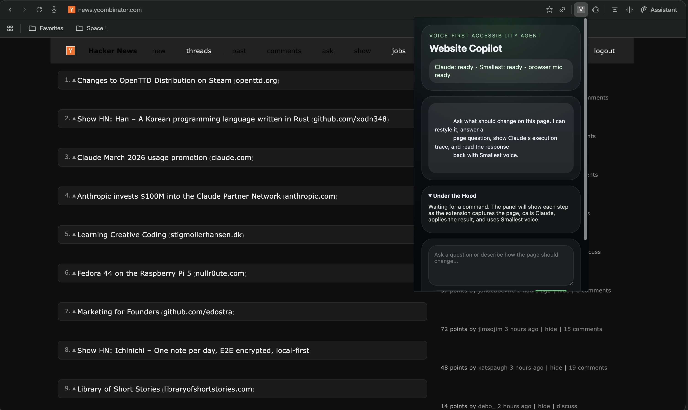

# Web Copilot

A voice-first Chrome extension that uses Smallest for speech, Claude as a background agent, and live DOM rewriting to make any website more accessible and interactive in real time.

It uses:
- Smallest `Pulse STT` for speech-to-text
- Smallest `Lightning TTS` for spoken responses
- Claude as the background agent through the [Anthropic Agent SDK](https://platform.claude.com/docs/en/agent-sdk/overview)
- a content script to capture the live DOM, apply CSS/DOM changes, and optionally persist those changes across reloads



## What It Does

- captures voice or typed requests from the extension popup
- snapshots the active page structure, content, controls, and visible post/story listings
- sends that page snapshot plus recent conversation history to Claude
- gets back structured JSON with:
  - `pageAnswer`
  - `summary`
  - `voiceResponse`
  - `generatedCss`
  - `domActions`
  - `settings`
- applies the generated UI changes directly to the live page
- speaks the response back with Smallest voice

## Example Use Cases

- “Make this page easier to read”
- “Keep this design but make the cards more rounded”
- “What is the third post on this page?”
- “Make this feel more like YouTube, but cleaner”
- “Increase contrast without losing the current layout”

## Architecture

1. The popup captures text or voice input.
2. Smallest `Pulse STT` converts speech to text.
3. The content script builds a structured page snapshot.
4. The local Node service sends the request to Claude through the Agent SDK.
5. Claude returns a structured plan for UI changes and answers.
6. The content script applies CSS and DOM actions in the current tab.
7. Smallest `Lightning TTS` speaks the final response back.

## Local Service

The local service runs at `http://127.0.0.1:8787` and exposes:

- `GET /health`
- `POST /api/voice/transcribe`
- `POST /api/voice/speak`
- `POST /api/agent/page-plan`

The page-plan endpoint uses Claude via `@anthropic-ai/claude-agent-sdk`, with retries, validation, and trace output before applying any generated changes.

## Setup

1. Create `.env.local` from `.env.example`.
2. Set:
   - `ANTHROPIC_API_KEY`
   - `SMALLEST_API_KEY`
3. Install dependencies:

```bash
npm install
```

4. Start the local service:

```bash
npm run dev
```

5. In Chrome:
   - open `chrome://extensions`
   - enable `Developer mode`
   - click `Load unpacked`
   - select this folder

## Usage

### Popup

1. Open any normal website.
2. Open the extension popup.
3. Type a command or click `Voice`.
4. If you use `Voice`, press `Stop` when you are done speaking.

### Keyboard Shortcut

- Default Mac shortcut: `Command+Shift+V`
- Default Windows/Linux shortcut: `Alt+Shift+V`

The shortcut opens the popup, starts voice capture automatically, and sends the command when you stop speaking.

You can change the shortcut in `chrome://extensions/shortcuts`.

### Persistence

- Turn on `Keep changes after reload` if you want page changes to remain after refreshing the website.
- Leave it off if you want transformations to stay temporary.

## Voice Stack

- Smallest Waves docs: [Getting started](https://waves-docs.smallest.ai/v4.0.0/content/getting-started/introduction)
- Smallest STT cookbook: [speech-to-text getting started](https://github.com/smallest-inc/cookbook/tree/main/speech-to-text/getting-started)
- Smallest expressive TTS cookbook: [expressive-tts](https://github.com/smallest-inc/cookbook/tree/main/text-to-speech/expressive-tts)

## Notes

- This is a load-unpacked extension. There is no frontend build step.
- Claude is API-backed. The local server is an orchestration layer, not a local model.
- The agent generates page-specific CSS and DOM actions instead of using hardcoded visual presets.
- The quality of page answers depends on the fidelity of the DOM snapshot captured from the current tab.
